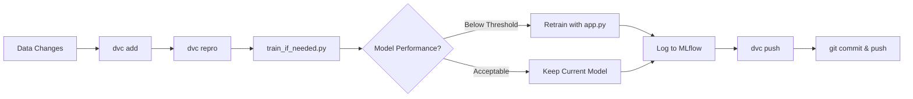

# 🚗 Automated Model Retraining with DVC and MLflow

This project demonstrates an **automated machine learning retraining pipeline** using **DVC** for version control and **MLflow** for experiment tracking.  
The model clusters acceleration and speed data to classify potential **potholes** or **speed bumps**.

---

## ⚙️ How the Pipeline Works

### 🔁 Overview

1. **Data versioning:**  
   Every dataset change is tracked using **DVC**. DVC generates unique hashes for data and maintains reproducibility.

2. **Model training & retraining:**  
   - The script `train_if_needed.py` checks the performance of the latest model.
   - If the model's performance (based on **Silhouette Score** or **Inertia**) drops below defined thresholds, retraining is triggered automatically.
   - Otherwise, the current model is retained.

3. **Experiment tracking:**  
   - **MLflow** logs parameters, metrics, and artifacts (models and output files) for each run.
   - You can compare experiment runs visually on the MLflow UI.

4. **Versioning & reproducibility:**  
   - DVC ensures each training run (code + data + model) is linked to a version ID.
   - This makes it easy to reproduce past runs using `dvc repro`.

---

## 🧠 Files Explained

### **`app.py`**
- Loads data from `data/anomalies.csv`
- Performs clustering using **KMeans**
- Logs:
  - Parameters (`n_clusters`, `random_state`)
  - Metrics (`inertia`, `silhouette_score`)
  - Artifacts (`output.csv`, model pickle)
- Saves the model with a timestamp in the `models/` folder
- Logs all information to **MLflow**

### **`train_if_needed.py`**
- Loads the most recent model
- Computes:
  - **Silhouette Score**
  - **Inertia**
- If performance is below thresholds:
  - Retrains by invoking `app.py`
- Otherwise:
  - Skips retraining
- If no existing model is found, trains a new one from scratch.

### **`dvc.yaml`**
Defines a single stage (`train`) that runs the conditional retraining pipeline.

```yaml
stages:
  train:
    cmd: python train_if_needed.py
    deps:
      - app.py
      - train_if_needed.py
      - data/anomalies.csv
    outs:
      - output.csv
```

---

## 🚀 Setup Instructions

### 1️⃣ Install Dependencies

```bash
pip install dvc mlflow scikit-learn pandas
```

### 2️⃣ Initialize DVC

Initialize DVC in your project folder:

```bash
dvc init
```

This will create a `.dvc/` directory and a `.dvcignore` file.

### 3️⃣ Set Up DVC Remote Storage

DVC needs a remote location (local folder or cloud) to store versioned data.  
For local setup, create a folder named `bucket` and add it as a DVC remote:

```bash
mkdir bucket
dvc remote add -d myremote bucket
```

If you face a `ModuleNotFoundError`, use:

```bash
python -m dvc remote add -d myremote bucket
```

### 4️⃣ Track Data with DVC

Let's tell DVC to track your dataset (e.g., `data/anomalies.csv`):

```bash
dvc add data/anomalies.csv
```

This command creates a new file `data/anomalies.csv.dvc` which stores the hash and metadata of the dataset.

Now commit the tracking info to Git:

```bash
git add data/anomalies.csv.dvc .gitignore
git commit -m "Track anomalies dataset with DVC"
```

To verify the data tracking status:

```bash
dvc status
```

### 5️⃣ Run MLflow UI

Run the MLflow tracking server to visualize experiment metrics, parameters, and models:

```bash
mlflow ui
```

By default, it runs at: http://localhost:5000

Keep this running in a separate terminal window.

### 6️⃣ Set Up the DVC Pipeline

Create a pipeline stage (for example, training) in `dvc.yaml`.  
If it's already created, you can simply reproduce the pipeline:

```bash
dvc repro
```

This command:
- Checks if your dataset or code has changed
- Runs `train_if_needed.py` (or your training script)
- Logs metrics and parameters to MLflow
- Saves the trained model to `/models`
- Generates output files like `output.csv`
- Tracks results with DVC

### 7️⃣ Verify DVC Stages and Outputs

To list the defined stages and dependencies:

```bash
dvc dag
```

To check which files or data have changed:

```bash
dvc status
```

### 8️⃣ Push Data and Models to Remote Storage

Once the pipeline has successfully run, push the versioned artifacts to the DVC remote:

```bash
dvc push
```

This ensures your data, models, and outputs are stored safely in the configured remote.

### 9️⃣ Git Commit and Push

Finally, commit everything to your Git repository:

```bash
git add .
git commit -m "Set up DVC + MLflow pipeline with automated retraining"
git push origin main
```

---

## 📊 Workflow Summary



---

## 🔧 Troubleshooting

### Issue: `ModuleNotFoundError` when running DVC commands
**Solution:** Use `python -m dvc` instead of `dvc`:
```bash
python -m dvc repro
```